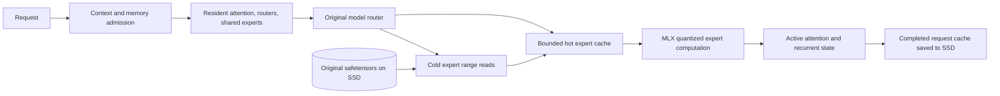

# Qwen, expert residency, and decoding investigation

Reviewed 2026-09-09 for this M2 Ultra / 64 GiB Mac and the pinned MLX runtime.

Later implementation updates: [Flash text adapters and cache enhancements](flash-server.md)
and [GGUF import with MLX execution](gguf-mlx.md). Large Flash downloads are paused;
full-checkpoint validation remains pending.

## Implemented execution path



The runtime retains frequently selected quantized expert projections in MLX unified
memory. Frequency scores decay, with recency breaking ties. Cache misses read just
the selected expert rows from the original safetensors files. All router-selected
experts execute, using their original quantization; the router and weights are not
pruned, reweighted, or requantized. Dense weights remain resident.

`--expert-cache-gib N` sets the maximum hot-expert residency. Before each request,
context admission can shrink that budget to leave room for the requested context,
then expand the allowed budget on later smaller requests. It fills on demand, not
by loading N GiB at startup. This is separate from inactive KV persistence.
Immutable expert weights need no writeback on eviction. KV snapshots do.

The current implementation deliberately evaluates each expert projection before
releasing its temporary selected-expert bank. It is a correctness-first implementation,
not an optimized slot-bank kernel. This bounds lazy graph retention but incurs CPU/GPU
synchronization and re-stacking overhead. The persistent hot budget excludes temporary
banks, dense weights, KV/recurrent state, the MLX allocator and OS filesystem cache.
It is not a cap on whole-process RSS. No performance parity with a fully resident
model is promised. No active-request token-level KV paging is implemented.

## Architecture support

Local validation passed all 10 regression tests, including quantized projection
parity, small Qwen MoE full-forward parity, hot-budget displacement by context,
and hybrid SSD continuation/branch handling. Both downloaded Qwen checkpoints
passed real chat, streaming, and exact-prefix SSD reuse (15 cached tokens).

On the real Qwen3.6 checkpoint, the short arithmetic smoke test produced identical
token IDs with resident weights and a 4 GiB hot cache. Fully resident weights used
18.17 GiB of MLX allocation; offload loaded 1.29 GiB of resident weights and peaked
at 5.42 GiB including its hot cache and computation. This is a two-output-token
correctness check, not a sustained throughput benchmark or whole-system RAM figure.
The separate HTTP check used a 12 GiB cache allowance and finished at 7.69 GiB of
MLX active allocation: the cache fills on demand rather than reserving its maximum.
Artifacts: `qwen3.6-35b-a3b-resident-check.json`,
`qwen3.6-35b-a3b-offload-check.json`, and both `*-api-check.json` files.

| Profile | MLX family | Attention layout | 4-bit KV bytes/token | Fixed recurrent-state estimate |
|---|---|---|---:|---:|
| K2 Horizon | custom `k2_horizon_mova` | 48 full-attention layers | 55,296 | 0 |
| Qwen3.8-27B | `qwen3_5` | 16 full + 48 Gated DeltaNet | 18,432 | 146.81 MiB |
| Qwen3.6-35B-A3B | `qwen3_5_moe` | 10 full + 30 Gated DeltaNet | 5,760 | 61.41 MiB |

Both Qwen profiles serve text through MLX-LM; this does not add image/video inputs.
Qwen3.8-27B is dense, so expert offloading is rejected for that profile. Qwen3.6 has
256 routed experts per layer, selecting 8, plus a resident shared expert. Their
published native context is 262,144 tokens. Larger advertised extrapolated contexts
require separate RoPE configuration and quality validation; this change uses native
limits. Architecture sources: [Qwen3.8 config](https://huggingface.co/Qwen/Qwen3.8-27B/blob/main/config.json),
[Qwen3.6 config](https://huggingface.co/Qwen/Qwen3.6-35B-A3B/blob/main/config.json).

Qwen's recurrent state cannot be arbitrarily rewound. SSD reuse therefore requires
the entire saved checkpoint to be a prefix of the new token sequence, with at least
one new token. Branches before that checkpoint are recomputed. K2 retains arbitrary
common-prefix trimming. Tokenization changes, chat-template changes, and whitespace
normalization can legitimately turn an apparent text prefix into a cache miss.

## Colibri and the two mlx-flash projects

There are at least two distinct projects named mlx-flash; both were checked because
no repository URL was supplied for that name.

- [Colibri](https://github.com/JustVugg/colibri) separates resident dense weights from
  streamed routed experts, with caches and routing history. Its
  [expert-store interface](https://github.com/JustVugg/colibri/blob/main/c/expert_store.h)
  requires active weight leases to remain valid until released. We implement the
  same essential lifetime rule by completing the projection before releasing its
  working set, using our existing MLX model code rather than Colibri's C engines.
- [matt-k-wong/mlx-flash](https://github.com/matt-k-wong/mlx-flash) loads lazily and wraps
  native model layers with streaming execution. Its
  [manager](https://github.com/matt-k-wong/mlx-flash/blob/main/mlx_flash/manager.py)
  configures a wired-memory budget and delegates to its flash engine. Layer-level
  streaming is useful context, but this task specifically needs routed-expert
  residency with a large RAM hot set.
- [szibis/mlx-flash](https://github.com/szibis/mlx-flash) has per-layer expert slot banks
  and frequency/age tracking. Its
  [expert streaming implementation](https://github.com/szibis/mlx-flash/blob/main/mlx_flash_compress/expert_streaming.py)
  also defines an uncached-expert skip fallback. That changes the computation,
  so it is not used here. Stable slot banks are a promising optimization to our
  current per-call selected-bank construction, provided misses are resolved before
  execution and slot lifetime is correct.

None of these projects was installed into the production environment. Their README
speed/hit-rate claims are not measurements on this machine. Cache effectiveness
must be measured against held-out prompts, cold starts, and topic changes.

## Parallel and speculative decoding

| Technique | Evidence | Current decision |
|---|---|---|
| Continuous batching | The installed `BatchGenerator` generated two requests together on small dense and MoE Qwen hybrid models | Feasible architecture-wise. Production remains sequential pending shared memory admission and cache/telemetry integration |
| 4-bit KV + batching | The installed HTTP server excludes batching when `kv_bits` is set; `BatchGenerator` has no KV-quantization argument | Increasing a concurrency number alone does not enable our current 4-bit path |
| Ordinary autoregressive draft model | Installed speculative generation requires every target cache to be trimmable; Qwen's `ArraysCache` fails that check | Explicitly unsupported for these Qwen profiles in this wrapper |
| Native MTP | Qwen configs declare an MTP layer, but pinned MLX-LM sanitization removes `mtp.*` weights; downloaded MLX checkpoint indexes have no MTP tensors | Needs companion weights/head implementation, hidden-state access, verification and recurrent-state rollback |
| DFlash | External MLX implementations exist with matched drafters | Investigated; not wired into this server |
| DSpark | `mlx-dspark` publishes Qwen3.8 and Qwen3.6 target/drafter pair support | Investigated; not wired into this server |

Probe evidence is in `decoding-probe.json`, produced by `probe_decoding.py` using
small random Qwen-family networks. It establishes basic runtime capability, not
full-checkpoint speed, output quality, or production readiness. It deliberately
uses unquantized KV for batching, which has a different memory footprint.

[mlx-dspark](https://github.com/ARahim3/mlx-dspark) is the most directly relevant
external integration candidate found: it publishes matched Qwen target/drafter
pairs and an MLX verifier. Its
[generation implementation](https://github.com/ARahim3/mlx-dspark/blob/main/src/mlx_dspark/generate.py)
uses block verification; parallel tokens within a speculative block are not the
same thing as batching independent client requests. Its
[dependencies](https://github.com/ARahim3/mlx-dspark/blob/main/pyproject.toml) add
MLX-VLM, so it should first be evaluated in a separate environment rather than
changing this pinned runtime in place.

A useful next implementation sequence is:

1. Optimize exact expert caching with persistent slot banks and bounded in-flight
   reads. Record miss bytes, time spent reading, hit ratio, and end-to-end latency.
2. Run a matched Qwen3.8 drafter/verifier in isolation and verify greedy token
   equality against plain generation. Then validate sampled acceptance, stop tokens,
   streaming, cancellation, recurrent rollback and cache persistence.
3. Evaluate Qwen3.6 speculation with expert misses included. A wider verify block
   can activate more unique experts and increase I/O, canceling the draft benefit.
4. Integrate independent-request batching with aggregate memory admission and
   explicit KV precision. Multiple Python workers would duplicate model weights
   and do not substitute for an efficient shared-model scheduler.

This work does not enable MTP, DFlash, DSpark or production parallel decoding.

## Where each served model stands (measured 2026-09-10)

All numbers are warm single-stream decode on this M2 Ultra with the model fully
resident unless noted. `check_model.py` reproduces the resident rows.

| Profile | Weights resident | Decode | Effective weight traffic |
|---|---:|---:|---:|
| Qwen3.8-27B (dense) | 15.1 GiB | ~27 tok/s fresh, ~19 tok/s by 10k tokens | ~0.5 TB/s |
| Qwen3.6-35B-A3B (MoE) | 19.5 GiB | 169.5 tok/s | ~280 GB/s |
| K2-Horizon (MoE) | 21.1 GiB | 46.6 tok/s | ~130 GB/s |
| Gemma 4 26B-A4B (MoE) | 14.2 GiB | 191.7 tok/s | ~150 GB/s |
| Qwen3.8-Flash-Next (streamed) | 9.2 GiB + hot set | 11.9 tok/s | 3.4 GiB/token selected |
| DeepSeek-V4-Flash (streamed) | 24.9 GiB + hot set | 3.3 tok/s | 70 GiB of experts on SSD |

The dense Qwen profile is at the memory wall: its whole 15.1 GiB is read on
every token. The earlier 67.6 tok/s figure was stale: re-measured at 26-28 tok/s fresh, degrading with context. Nothing
except fewer bytes per token (lower-bit weights), fewer tokens per second of
work (batching), or speculative decoding can improve it.

The two MoE profiles are **not** bandwidth-bound. K2's routed experts and its
MoVA value experts together account for only about 9% of its decode time
(ablating each in turn: 4.1% and 4.8%), and compiling its router arithmetic
changed throughput by 0.5%. Its cost is spread evenly across all 48 layers at
roughly 0.8 ms per MoVA layer, which points at per-layer latency rather than
arithmetic or traffic. Qwen3.6's smaller active set shows the same shape.

For the two streamed profiles the lever is residency rather than compute: Qwen's
experts total 37 GiB and DeepSeek's 70 GiB, so a hot set large enough to hold
Qwen's working set turns its 5.4 tok/s cold decode into 11.9 tok/s, while
DeepSeek still re-reads a few GiB per long generation.

## How this engine compares (research, 2026-09-10)

Eight engines serve LLMs on Apple Silicon today: MLX/mlx-lm, llama.cpp with
Metal, Ollama, LM Studio (llama.cpp and mlx-engine runtimes), vLLM through its
Metal plugin, MLC-LLM, ExecuTorch and PyTorch MPS. The only apples-to-apples
multi-engine measurement on M2 Ultra class hardware found is an independent
study (arXiv 2511.05502, Qwen-2.5-Coder-3B): MLX about 230 tok/s decode, ahead
of MLC-LLM (~190), llama.cpp (~150 short-context, collapsing to ~1.2 tok/s at
32k context), Ollama (20-40) and PyTorch MPS (7-9). Vendor tables are higher and
measured on newer silicon — mlx-lm reports 1622 tok/s prefill and 134.5 tok/s
decode for Qwen3-4B-4bit on an M4 Max, and llama.cpp's community table reports
1489/125 for Llama-2-7B Q4_0 on an M2 Ultra.

Against that field this engine is an MLX engine with two unusual properties: it
serves one request at a time with 4-bit KV, and it can stream IQ1 experts from
SSD instead of holding weights resident — a regime no mainstream engine ships.
Its numbers therefore belong next to resident bytes, expert hit rate and read
volume rather than beside the tables above. The capabilities mainstream engines
have that this one does not are continuous batching, paged KV, speculative
decoding (draft, MTP, DFlash, DSpark, n-gram) and cross-request prompt-cache
checkpointing; `mlx_lm`'s own `BatchGenerator` is present in the pinned runtime
but unused here, and the 4-bit KV path excludes it upstream.

## Full-context behaviour (measured 2026-09-10)

Every resident profile, prefilled with synthetic prose and then decoded for
eight tokens, at increasing prompt lengths. `check_context_scaling.py`
reproduces this (it writes `<model>-context-scaling.json`).

| Profile | 2k prefill / decode | 32k prefill / decode | 131k prefill / decode | MLX active at 131k |
|---|---|---|---|---|
| Qwen3.6-35B-A3B | 657 tok/s / 75.8 tok/s | 645 / 55.3 | 412 / 30.2 | 18.9 GiB |
| Gemma 4 26B-A4B | 596 / 79.1 | 706 / 52.3 | 515 / 24.7 | 15.9 GiB |
| Qwen3.8-27B | 194 / 30.5 | 179 / 22.0 | 123 / 11.7 | 16.5 GiB |
| K2-Horizon | 394 / 39.1 | 250 / 27.3 | 104 / 13.4 | 26.4 GiB |

Three things fall out of this.

**Decode falls by 2.5-3x between 2k and 131k context for every profile.** That is
attention over a long cache, not the KV format: an A/B on Qwen3.8-27B at 8k
context measured 28.1 tok/s with 4-bit KV against 29.4 tok/s with bf16 KV, a 5%
difference, while prefill was identical to the hundredth of a second. KV
precision is not the long-context lever; the attention pattern is.

**Sliding windows pay off exactly where the table says they should.** Gemma 4
keeps 25 of its 30 layers on a 1024-token window and decays least (79 -> 25
tok/s), while K2 - all 48 layers full attention at 55,296 bytes/token - decays
most in prefill (394 -> 104 tok/s).

**Prefill cost tracks the KV read, not the prompt length.** K2 and Qwen3.8-27B
slow down 3.8x and 1.6x respectively, while Qwen3.6 and Gemma 4 barely move;
the former pair are the two profiles whose caches are large and dense.

## K2-Horizon decode attribution, and an ablation caveat

Ablating K2-Horizon's components one at a time on a single decode step
(22.4 ms/token baseline):

| Component removed | Cost |
|---|---:|
| Whole MoE block (router + experts + shared expert) | 47% |
| Both attention types | 45% |
| Grouped RMSNorm layers | 8% |
| Routed expert matmuls alone | 3-4% |
| MoVA value-expert matmuls alone | 3-5% |
| Router arithmetic, measured by fusing it into one compiled graph | 2.6% |

The last two rows are a caution about ablation: replacing the router with a
stub makes every layer select expert 0, which collapses the *expert* work as
well, and that measured 30% - a number that says more about the stub than about
the router. Fusing the real router path into a compiled graph, which preserves
the selections, gains 2.6%. Attention and the MoE block each hold about half the
step, but neither has a dominant term inside it: the cost is spread over many
small operations per layer, 48 layers deep.

## Batching is now available where the KV cache allows it

`--decode-concurrency` and `--prompt-concurrency` expose the upstream
`BatchGenerator`. The pinned runtime refuses to batch with a quantized KV cache
(`QuantizedKVCache` has no `merge`), so `serve.py` raises a clear error when
batching is requested for a profile in `model_profiles.UNQUANTIZED_KV` and
otherwise passes the flags through. Profiles whose caches are plain or rotating
(Gemma 4, DeepSeek V4 Flash) can batch; the others cannot until upstream
supports merging quantized caches.

Measured on Gemma 4 26B-A4B over HTTP, 128 output tokens per request, same
server process:

| Load | Wall | Tokens | Aggregate | Per-request latency |
|---|---:|---:|---:|---:|
| 1 request | 1.9 s | 128 | 68.0 tok/s | 1.9 s |
| 4 concurrent | 4.2 s | 512 | **123.1 tok/s** | 4.1 s |

That is 1.8x aggregate throughput for 2.2x per-request latency - the usual
batch trade - and it costs nothing in KV precision, which the earlier A/B
measured at about 5% of decode speed. The research literature agrees that this,
not kernel micro-optimisation, is the remaining lever: batch-1 decoding on fast
accelerators is launch- and bubble-limited, and MLX has no graph-replay path to
recover that overhead.

## Concurrency correctness

Throughput is only half the question: batching must not change what a request
returns. `check_concurrency.py` runs four different capital-city questions
sequentially, then the same four with all of them in flight, and requires the
answers to be byte-identical; it also repeats one prompt concurrently, pushes
eight requests through four slots, and mixes streaming with non-streaming. On
Gemma 4 with `--decode-concurrency 4` the run reports zero failures: concurrent
answers match sequential ones exactly, repeated concurrent answers are
identical, oversubscribed requests all complete correctly, and streaming
finishes with `[DONE]` while another request is decoding.

## Speculative decoding: the stack runs, and it loses to this target

The vendored `mlx-vlm` tree already carries a complete speculative stack
(`vendor/flash_vlm/speculative/`: dflash/mtp/eagle3 round loops, thirty drafter
implementations, and a cache-transaction layer). That stack solves the blocker
recorded earlier in this document: the hybrid target's recurrent layers are not
rewound, they are snapshotted and restored around each round, so the "ArraysCache
cannot be trimmed" objection no longer applies.

To run it, the target had to be loaded through the vendored Qwen3.5-MoE class
rather than through the pinned runtime's, because only that class exposes the
`capture_layer_ids` / `rollback_speculative_cache` hooks. Two things were needed
and are now in `check_speculative.py`: the text tower loads **under the wrapper's
`language_model.` naming** so the checkpoint's per-module quantization map still
matches - the router gates of the local 4-bit checkpoint are quantized to 8 bits
while the rest is 4, so a blanket `nn.quantize` silently loads the wrong shapes -
and the multimodal `qwen3_vl` re-exports had to be restored in the vendored tree.
Loaded that way the target is not bit-identical to the serving path (different
rope/attention kernels, logits differ by up to 1% of their range) but the top-5
ranking is identical, which is the property verification consumes.

Two published drafters for exactly this family were loaded and run against the
local 4-bit target - DFlash (`z-lab/Qwen3.6-35B-A3B-DFlash`, 736 MiB, 6 layers,
block 16) and DSpark (`jinzex/Qwen3.5-35B-A3B-DSpark`, 963 MiB, 6 layers, block
8, target-vocabulary head). Greedy speculation with either is **lossless**: at
every block size tried, the speculative continuation reproduces the plain greedy
one token for token, which is also the proof that the cache transactions handle
this hybrid target correctly.

Both are also slower than not speculating:

| Drafter | Block | Speculative | Baseline | Speedup | Accepted per target forward |
|---|---:|---:|---:|---:|---:|
| DFlash | 16 | 43.0 tok/s | 78.1 tok/s | 0.551 | 2.29 |
| DFlash | 8 | 45.2 tok/s | 78.0 tok/s | 0.580 | 2.29 |
| DFlash | 4 | 46.4 tok/s | 78.6 tok/s | 0.590 | 2.29 |
| DSpark | 8 | 34.3 tok/s | 78.0 tok/s | 0.440 | 1.78 |
| DSpark | 4 | 34.4 tok/s | 78.6 tok/s | 0.438 | 1.78 |
| DSpark | 2 | 76.4 tok/s | 78.6 tok/s | 0.972 | 1.60 |

Two things set the economics, and both are visible in the table. The first is the
target: a 4-bit MoE decoding at 78 tok/s is about 13 ms per token, so a round of
speculation has to yield more tokens than the round costs - and these drafters
yield 1.6 to 2.3. The second is the architecture. Verifying a k-token block costs
a target forward over k+1 positions, and on a 256-expert MoE with top-8 routing
that activates about 8(k+1) experts per layer rather than 8, so the verify gets
*more* expensive with every token of block width instead of staying close to free
the way it does on a dense model. That is why the speedup falls away as the
block grows and why the only configuration that reaches break-even (DSpark at
block 2, 0.972x) is the one that drafts almost nothing.

Neither drafter was trained against this target. They predict the next tokens of
the *bf16* Qwen3.5/3.6 base model, while the target here is 4-bit: the drafter
and the verifier disagree more often than the published acceptance numbers
suggest, and acceptance is the entire payoff. [INFERENCE] Checking that would
mean running the same drafters against a bf16 target, which does not fit on this
machine alongside everything else.

DSpark's cheaper head is real - it projects onto a 32,000-token draft vocabulary
over 8 positions where DFlash projects onto 248,320 over 16, roughly 15x less
head traffic per round - but its acceptance is lower, so it lands behind DFlash
at equal block width and only wins by shrinking the block to the point where
there is nothing left to accept.

### MTP is the first speculative method that wins here

The MTP head is a different shape of bet from the block drafters: one decoder
layer that proposes a single extra token per round, so a round costs one layer's
forward instead of a six-layer block, and the verify is two positions wide
instead of nine or seventeen. On this target that is exactly the arithmetic that
works. `models/qwen3.6-mtp/` holds the head extracted from
`Qwen/Qwen3.6-35B-A3B` - 20 tensors, 1.57 GiB bf16, fetched by HTTP range
request straight out of the two shards that carry `mtp.*` rather than
downloading 66 GB of checkpoint - mapped into the vendored drafter's naming by
calling that drafter's own `sanitize` on the raw tensors, and it strict-loads
against the module (20/20 keys).

| Target | Block | Speculative | Baseline | Speedup | Accepted per round |
|---|---:|---:|---:|---:|---:|
| Qwen3.6-35B-A3B | 3 | 93.2 tok/s | 77.5 tok/s | **1.201x** | 2.37 |
| Qwen3.6-35B-A3B | 2 | 85.2 tok/s | 79.3 tok/s | 1.075x | 1.78 |
| Qwen3.6-35B-A3B | 6 | 66.1 tok/s | 79.5 tok/s | 0.832x | 3.05 |
| Qwen3.6-35B-A3B | 4 | 49.6 tok/s | 79.4 tok/s | 0.625x | 2.46 |
| Ornith-1.5-35B-A3B | 3 | 94.4 tok/s | 78.2 tok/s | **1.207x** | 2.37 |

Every run is lossless: the speculative continuation reproduces the plain greedy
one token for token. Block 3 is the configuration the head ships with and also
the best one measured; acceptance climbs with block width (3.05 tokens per round
at block 6) but the round gets more expensive faster, and block 4 lands in a
worse place than either of its neighbours for reasons this measurement does not
explain.

The head transfers to the Ornith fine-tune unchanged - same acceptance, same
speedup - which is what one would expect from a fine-tune that shares the base
model's tokenizer and next-token distribution.

The published DSpark speculator for this family
(`RedHatAI/Qwen3.6-35B-A3B-speculator.dspark`) is not loadable as-is: it follows
the `speculators` checkpoint convention with a 32,000-token draft vocabulary plus
`d2t`/`t2d` mapping tensors, while the vendored MLX drafter has no
draft-vocabulary concept and ignores them. The target-vocabulary build used above
avoids that conversion entirely.

The MTP route is narrower than it looks as well. Qwen3.5/3.6-35B-A3B and Ornith
(`ornith-ai/Ornith-1.5-35B-A3B`, MIT, the same `qwen3_5_moe` architecture this
engine already serves) all ship `mtp.*` tensors - 786 of them, 1.69 GB, in
Ornith's shard 16 - but every local MLX checkpoint, including the one this engine
serves, was converted with those tensors filtered out, and the pinned runtime's
`sanitize` drops them too. They are recoverable from the MTP-preserving GGUFs
(`unsloth/Qwen3.6-35B-A3B-MTP-GGUF`) with the vendored `qwen3_5_mtp` splitter,
which is a conversion job rather than a runtime change. Given that a 6-layer
external drafter already loses to plain decoding here, a single-layer MTP head is
the more promising shape: it drafts one token at a time for far less than a full
draft block costs, which is exactly the regime the block-2 result above finds
break-even.

## Prefill, KV width and batching: what the knobs actually buy

`check_optimizations.py` measures one server configuration per run (warm-up
first: the first request after a model load pays page-fault costs that alone can
move a number 5x, which is how a 5,000 tok/s prefill first looked like 1,000).
Every number below is after that warm-up.

**Batching is the reliable decode lever.** With the server started at
`--decode-concurrency 4`, four simultaneous requests aggregate well above one
stream, on every family measured:

| Model | Single stream | 4 concurrent | Speedup |
|---|---:|---:|---:|
| SmolLM3-3B | 118.9 tok/s | 215.3 tok/s | 1.81x |
| Gemma 4 26B-A4B | 68.0 tok/s | 123.1 tok/s | 1.81x |
| Gemma 4 31B | 22.4 tok/s | 31.9 tok/s | 1.42x |
| Qwen3.5-9B | 74.9 tok/s | 102.0 tok/s | 1.36x |

**KV width barely matters for speed, and matters a lot for reuse.** At short
context, 4-bit, 8-bit and unquantized KV decode within a few percent of each
other (66.9 / 65.5 / 66.7 tok/s on Ornith) and prefill is unaffected once warm.
What changes is what the runtime *allows*: the pinned runtime cannot merge or
trim a quantized cache, so prompt-prefix reuse only works with `--kv-bits 0`.
That is worth far more than the few percent of decode it costs - at a 32k prompt,
the same request repeated against the same server returns its first token in
0.49 s instead of 48.07 s, a 97x reduction, because the prefix is already in
cache. `--kv-bits 0` is also what makes batching legal, so the two features come
as a pair.

**Prefill has a cliff above roughly 2k prompt tokens, and it is upstream's.**
Measured on Qwen3.5-9B with a warm cache:

| Prompt | TTFT | Per token | Rate |
|---:|---:|---:|---:|
| 2,076 | 0.19 s | 92 us | 11,009 tok/s |
| 4,141 | 5.33 s | 1,288 us | 776 tok/s |
| 8,236 | 10.64 s | 1,292 us | 774 tok/s |
| 16,426 | 21.86 s | 1,331 us | 751 tok/s |

The cost is linear in tokens but 14x worse per token once the prompt passes a
few thousand tokens, and the step is not ours: the stock `mlx_lm.server` on the
same checkpoint, same flags, prefills the 8,236-token prompt in 10.58 s (779
tok/s) against our 10.99 s (750 tok/s). The chunked-prefill step size does not
move it either (750 / 774 / 761 tok/s at step 512 / 2048 / 4096), so it is not
the chunk loop. What this means in practice is that long prompts should be
prefilled once and reused, which is exactly what `--kv-bits 0` plus
`--prompt-cache-size` buys.

**Prefill step size is not a lever.** Once the model is warm, 512 and 4096 give
within 8% of each other (4,922 vs 5,338 tok/s on Ornith). The default was raised
from 128 to 512 anyway, since the smaller default only adds chunk-loop overhead
with no benefit.

## New profiles

Beyond the original seven, the engine now serves Gemma 4 31B (dense, 60 layers,
16.1 GiB resident, 22.6 tok/s decode, 4,752 tok/s prefill) and a set of small
models that resolve through the generic `mlx_lm` path: Qwen3.5-9B (4.8 GiB,
70.9 tok/s), Qwen3.5-4B (2.3 GiB, 94.8 tok/s), Llama-3.2-3B (150.0 tok/s) and
SmolLM3-3B (1.6 GiB, 115.2 tok/s). Ornith-1.5 35B-A3B is a drop-in for the
`qwen3_5_moe` path - identical architecture, including the 8-bit router gates -
and runs at 67.4 tok/s decode in 18.2 GiB, with output that the API check
accepts for both plain and streaming requests.

One gap to record: the exact-prefix continuation check fails for Llama-3.2-3B
(`No completed prefix checkpoint saved`), so disk prompt-cache continuation is
not working for that model while it does for the others.

## Nemotron 3.5 Lightning 30B-A3B

`mlx-community/NVIDIA-Nemotron-3.5-Lightning-30B-A3B-4bit` runs on the pinned
runtime unchanged - `mlx_lm` ships `nemotron_h`, so it needs no adapter, only a
profile entry. It is a hybrid: of its 52 layers, 23 are Mamba, 23 are MoE and 6
are full attention, with 128 routed experts taking 6 per token, and its Mamba
state is fp32 (`mamba_ssm_cache_dtype`). Resident cost is 16.6 GiB and decode
runs at 86.2 tok/s single-stream, 145.9 tok/s at four concurrent requests
(1.69x), with the API check passing for plain and streaming requests.

Its per-token prefill cost is the best measured on this machine, and its prefix
reuse is the strongest:

| Prompt | Per token | Prefill | Reuse speedup |
|---:|---:|---:|---:|
| 8,226 | 881 us | 1,136 tok/s | 51.2x |
| 32,809 | 982 us | 1,018 tok/s | 153.6x |

For comparison the dense Qwen3.5-9B path costs 1,292 us/token at 8k. The
difference is the architecture: only 6 of 52 layers carry a growing KV cache, so
long context is cheap here in a way it is not for a dense model.

### Long prompts need small prefill steps, or Metal kills the command buffer

NVIDIA validates this model at 256K context on a single 80 GB H100 and at 1M on
multi-GPU parts; the config declares 262,144 and the engine enforces that with an
actionable error (`Prompt has 264020 tokens; current memory-aware context limit
is 262144`). What the config does not tell you is how to *get* there. A
198k-token prefill at the default chunk size ran the GPU long enough in one
command buffer that macOS terminated it:

```
[METAL] Command buffer execution failed: Impacting Interactivity
(0000000e:kIOGPUCommandBufferCallbackErrorImpactingInteractivity)
```

At `--prefill-step-size 64` the same prompt completes: 198,027 tokens in
1,004.6 s, about 197 tok/s. `--prefill-step-size` is therefore not a throughput
knob, it is the knob that keeps a long prefill inside the window macOS gives a
command buffer - the earlier finding that step size does not change short-prompt
throughput still holds, and the two facts are consistent: smaller chunks cost
nothing when the prompt is short and are the difference between finishing and
being killed when it is not.

### Serving the head

`--mtp-draft models/qwen3.6-mtp` turns speculation on for a `qwen3_5_moe`
profile. Over HTTP, on the same prompt and the same greedy settings, the server
returns byte-identical text and gets there faster:

| Configuration | Decode | Accepted per round |
|---|---:|---:|
| `--kv-bits 0` | 59.2 tok/s | - |
| `--kv-bits 0 --mtp-draft models/qwen3.6-mtp` | **94.4 tok/s** | 2.91 |

That is 1.59x over the API, against 1.47-1.49x measured inside the round loop -
the extra comes from the requests being warmer, not from the server doing less
work per token.

Two things had to be got right for this to run at all, and both are properties
of the vendored stack meeting the pinned runtime:

- The target has to be loaded through the *vendored* Qwen3.5-MoE class, because
  only it captures the hidden state and shared KV the head drafts from. That is
  what `--mtp-draft` switches on; the ordinary path keeps the pinned runtime.
- The target must not be marked batchable. `make_prompt_cache` on the vendored
  model reports mergeable caches, so the server would otherwise route requests
  to the batch generator, which builds mlx_lm cache types that the vendored
  linear-attention layers reject (`ArraysCache` has no `update_window`). MTP mode
  therefore forces the single-request generator and always prefills fresh: the
  disk prompt cache restores mlx_lm cache types too, and the round loop needs a
  prefill it performed itself. Prefix reuse and drafting are alternatives, not
  companions - `--kv-bits 0` buys the first for the ordinary path, `--mtp-draft`
  buys the second.

The server logs `MTP: emitted N tokens over M rounds (X accepted per round)` per
request, so acceptance is observable in production rather than only in a
benchmark, and `MTP: prompt cache <hit|miss>, N of M prompt tokens reusable` per
request, so cache behaviour is too.

### What prompt-prefix reuse can and cannot do

Reuse is narrower than the headline numbers suggest, and the reason is worth
recording because it is the same cache-trimmability limit that blocked
speculation. `LRUPromptCache` holds whole sequences and offers three ways to
answer a request: an exact match, a stored entry that is a strict prefix of the
request, or a stored entry *longer* than the request's common prefix - and only
the third needs `trim_prompt_cache`. Hybrid caches cannot be trimmed, so:

- An **exact repeat** hits for every model: 97x first-token at a 32k prompt on
  Qwen3.5-9B, 153x on Nemotron. This is the case that matters for retries,
  evaluations and repeated system prompts.
- A **strict extension** (a cached sequence that is a prefix of the new request)
  hits.
- A **chat turn** usually hits none of them: the stored entry ends with the
  tokens the model generated, plus template markers, so it is not a prefix of the
  next turn's rendered prompt, and trimming it back to the common prefix is
  exactly what a hybrid cache refuses to do.

MTP mode therefore reuses when there is a strict prefix to continue from and
otherwise prefills fresh, because the head needs a prefill it performed itself.
The two features stay complementary: `--kv-bits 0` for exact-repeat reuse on the
ordinary path, `--mtp-draft` for 1.5-1.6x decoding.

Two attempts to widen this are now in the engine and worth recording, because
the second one explains why the ceiling is where it is.

**A prefill snapshot was tried and removed.** The idea was to store the cache as
it stood when prefill finished, keyed by the prompt alone, so a later request that
extends the prompt would match it directly rather than having to trim a stored
sequence back. It does not work: the snapshot is taken from the progress callback,
which fires one decode step after the prompt is evaluated, so the cache covers
more tokens than the key records, and the disk cache correctly refused to store an
entry whose offset ran past its token list. The feature was silently doing nothing,
which is worse than not having it, so it is gone.

**The disk cache distinguishes a complete entry from a sampled tail.** Entries are
indexed on `tokens[:-1]`, because a cache that stops at the last sampled token
never evaluated it - and because every caller needs at least one token left to
process. An entry whose offset reaches the end of its token list is recorded as
`complete` and may match on its final token, but the returned prefix is still
capped so a hit can never consume the whole query: the batch generator raises on
an empty prompt, which is how that invariant was discovered.

Neither closes the chat-turn case, and the reason is not the cache. Measured on
Qwen3.5-9B, the second turn of a conversation shares **1215 of the first turn's
1219 prompt tokens**; the divergence is the assistant generation marker
(`<|im_end|>` `<|im_start|>` `assistant`) that the first prompt ends with and the
second turn's rendering does not reproduce at that position. A rendered
conversation is therefore not a token prefix of its own next turn, and no
amount of caching fixes a prefix that does not exist. This is a known production
problem rather than a quirk of this engine: vLLM measured a **1.7% prefix cache
hit rate across 610 agentic traces** and attributed it to chat templates rather
than cache size.

What would actually fix it is reuse at the level of the conversation rather than
the token stream - caching after each complete message and rendering each turn
through the same prefix - which is a change to how prompts are assembled, not to
the cache.


## Decode speed degrades with context, and precision does not change it

Measured on Qwen3.8-27B with a long reasoning-heavy generation (the workload the
report came from), with the rate taken per 1,024-token window:

| token | tok/s |
|---:|---:|
| 1,024 | 27.3 |
| 4,096 | 26.0 |
| 6,144 | 22.6 |
| 8,192 | 21.9 |
| 10,240 | 18.8 |

That is a 31% drop over 10k tokens. An A/B at kv-bits 0 versus 4 shows the same
-15% slope in the first 4k either way, so it is attention *compute* growing with
context, not KV bandwidth - compressing the KV cache to 4 bits saves memory (and
is on by default: `quantized_kv_start` is 0, so old reasoning is already
compressed) but does nothing for the slope.

What does help is a smaller effective context. The chat template already drops
historical thinking for these models, so the remaining lever is clients that put
reasoning *in* the message content: `--thinking-budget N` prunes every earlier
assistant turn's reasoning to at most N tokens (0 drops it). Measured on a
six-turn reasoning-heavy conversation: the prompt falls from 9,609 tokens to
1,789 (-81%) and the request from 49.5 s to 12.9 s (3.8x faster).
