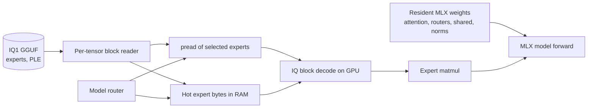

# IQ1 GGUF experts with MLX inference

Plan and measured basis for serving the two Flash text profiles from Unsloth IQ
quants instead of their 4-bit MLX checkpoints. Written 2026-09-10 for this
M2 Ultra / 64 GiB Mac. Downloads are pinned by `setup_gguf.py` into
`model-configs/*.gguf.lock.json` and land in `gguf/<alias>/`.

## Why the MLX checkpoints cannot be used

The downloaded 4-bit MLX checkpoints are 111.5 GB (`qwen3.8-flash`) and 151.5 GB
(`deepseek-v4-flash`) of weight bytes. Neither fits in 64 GiB of unified memory,
and the IQ1 quants are the only published form of these models small enough to
make a resident-plus-streaming split worthwhile.

Requantizing IQ into MLX's affine formats does not preserve that advantage: MLX
supports 2/3/4/6/8-bit affine only (`mx.quantize`; no 1-bit mode), and the
quantized MLX path stores a scale and bias per group, so 2-bit with group size 64
costs 2.5 bits/parameter. DeepSeek's IQ1_S/IQ2_XXS expert tensors would grow from
36.9 GiB to about 54 GiB before any quality loss from double quantization is
counted. `mx.load` also cannot read IQ tensors at all: of the GGML types tested,
only Q4_0, Q4_1, Q8_0, Q2_K, Q4_K and Q6_K load, and they are expanded to f16.

## Measured quant inventory

Both files were inspected through range requests on their GGUF headers; no full
download was needed to produce these numbers. Shard 1 of each split carries the
metadata only (0 tensors); all tensors live in shards 2 and 3.

| | Qwen3.8-Flash-Next UD-IQ1_S | DeepSeek-V4-Flash UD-IQ1_S |
|---|---:|---:|
| File size | 67.55 GiB | 76.87 GiB |
| Tensors | 1224 | 1328 |
| Layers / experts / selected | 48 / 512 / 10 | 43 / 256 / 6 |
| Routed-expert bytes | 37.11 GiB | 70.36 GiB |
| Other resident bytes | 3.62 GiB | 6.51 GiB |
| PLE n-gram table | 26.82 GiB (`per_layer_token_embd`) | — |
| Expert quant types | IQ1_S 10.38, IQ4_NL 21.09, IQ2_XXS 5.64 | IQ1_S 23.44, IQ3_XXS 31.39, IQ2_XXS 13.41, MXFP4 2.12 |

Consequences for a 64 GiB machine:

- **Qwen3.8-Flash-Next**: experts (37.11 GiB) plus the non-PLE dense tensors
  (3.62 GiB) fit in RAM; the 26.82 GiB n-gram table must stream. Only a few rows
  of that table are read per token, so this is the favorable case.
- **DeepSeek-V4-Flash**: 70.36 GiB of routed experts alone exceed the machine.
  The dense tensors stay resident and experts split between a hot RAM cache and
  SSD reads. Per token, 43 layers x 6 experts x ~6.6 MiB is about 1.7 GB of
  expert bytes when nothing is cached.

## Decoding IQ blocks on the GPU

`iq_quants.py` decodes IQ1_S, IQ1_M, IQ2_XXS, IQ3_XXS, IQ4_NL and MXFP4 as MLX
operations. Grid and sign tables are taken from the pinned `gguf` package so
there is a single source of truth. Types without a device decoder fall back to
the reference implementation.

`iq_metal.py` decodes the same five formats MLX can execute as expert weights
(IQ1_S, IQ2_XXS, IQ3_XXS, IQ4_NL, MXFP4) in a single Metal dispatch per tensor,
writing float16 directly. `StreamingFusedSwitchGLU` prefers these kernels and
falls back to `iq_quants` for anything else. Building one layer's expert bank
(6 experts x 3 projections, the real DeepSeek shapes) takes 9.9 ms with the
op-chain decoders and 2.86 ms with the kernels, a 3.5x difference that shows up
as 426 ms versus 123 ms per token over 43 layers.

The kernels deliberately stop at dequantization instead of fusing the matmul:
llama.cpp's own measurements report the codebook-LUT matvec path as slower than
plain Q4_0 on Apple GPUs, so decoding to float16 and handing the result to
MLX's optimized `gather_mm` avoids that pitfall. A fused dequant-and-matmul
kernel remains a possible later step; the affine MoE kernels vendored with
MLX-VLM in `research/` show the shape such a kernel would take.

`test_iq.py` requires bit equality with the reference decoders on random blocks
for all six formats, and the same decoders were checked against tensors read out
of the real Unsloth files (`blk.0.ffn_down_exps` IQ4_NL, `blk.0.ffn_gate_exps`
IQ1_S, `blk.1.ffn_gate_exps` IQ2_XXS), also bit-exact. `test_iq_metal.py`
requires the kernels to reproduce both the reference decoders and the op-path
decoders exactly.

## Architecture

- **Resident**: non-expert tensors decoded once at load (small: 3.6-6.5 GiB
  packed, roughly double as f16). Attention, routers, shared experts and norms
  are touched every token, so they never stream.
- **Streamed**: routed experts stay in their original GGUF blocks; only the
  router-selected rows are read. This reuses the `expert_cache.py` policy
  (frequency/recency heap, budget resized from context admission) with the
  quantized MLX store replaced by GGUF block reads and `iq_quants` decode.
- **RAM budget**: the hot cache grows to whatever admission leaves after dense
  weights, KV and workspace. DeepSeek keeps a large hot set; Qwen keeps all
  experts resident and streams only n-gram rows.

The scheduler is the existing admission path extended to three populations
(dense, expert hot cache, PLE row cache). Sizes are re-derived per request from
available RAM, MLX active memory and Metal's recommended working set, and the
cache shrinks before a long prompt and expands again afterwards. Prefetching the
next layer's experts while the current layer computes is the main open
optimization; the current design evaluates each projection before releasing its
bank.

## DeepSeek V4 Flash: working path

`gguf_model.py` maps every resident parameter of the vendored `deepseek_v4`
model onto its GGUF tensor and installs `StreamingFusedSwitchGLU` over the
routed experts. The `deepseek4` converter applies no transposes, splits or
permutations, so the mapping is a name table plus two runtime conventions:
`attn_output_a` is reshaped to `(o_groups, o_lora_rank, -1)` for `MultiLinear`,
and hyper-connection/router/sink parameters stay float32.

The name table is exact against the shipped file: 1328 expected tensors,
1328 present, none unmapped. All 1199 model parameters load; the 512x43
experts are not materialized at load.

Measured on this machine (`check_gguf_model.py --model deepseek-v4-flash`),
64 generated tokens with a 6 GiB hot set:

| | |
|---|---:|
| Load (dense decode + eval) | 75 s |
| Decode, warm cache | 1.68 tok/s (597 ms/token) |
| MLX active after load | 21.2 GiB (peak 33.5 GiB) |
| Hot set | 943 packed projections of 6 GiB, 2332 evictions |
| Expert reads | 31.9 GB, 71% hit rate |
| Output | " Paris. The capital of Italy is Rome. ... The capital of Belgium" |

Two changes took decode from 10.4 s/token to 0.60 s/token. First, a layer's
selected experts are fetched once, decoded into a bank and applied with three
`gather_mm` calls, so a layer costs a handful of operations instead of one
round trip per expert. Second, the IQ blocks are decoded by the single-dispatch
Metal kernels in `iq_metal.py` instead of the op chain.

Profiling one decode step at steady state splits the cost as roughly 75% in
decoding and stacking the expert banks, 7% in the gathers and activation, and
the remainder in fetching from the hot set plus the dense model. Stubbing the
expert module out entirely decodes at 0.063 s/token, so the whole expert path
was 94% of the per-token cost before the kernel change.

Hit rate against hot-set budget over a 32-token generation:

| budget | hit rate | tok/s | reads |
|---:|---:|---:|---:|
| 2 GiB | 42.3% | 0.92 | 33.7 GiB |
| 6 GiB | 67.8% | 0.94 | 18.8 GiB |
| 12 GiB | 75.3% | 0.99 | 14.4 GiB |
| 24 GiB | 75.5% | 1.02 | 14.3 GiB |

Two things follow. The working set of a generation saturates: beyond roughly
12 GiB the hit rate stops moving. And I/O is not the limit — halving the miss
traffic changes throughput by about 10%. Stubbing the expert module out
entirely decodes at 0.063 s/token instead of ~1.0 s/token, so about 94% of the
per-token cost is the expert path itself (read, decode into float16, bank
assembly, gather) and only ~60 ms is attention, compression, indexer and
hyper-connections.

Residency also follows router mass: every selection adds its router score to
that expert's cache priority, so eviction drops the experts the router leans on
least (REAP-style weighting without pruning any expert — cold experts stay in
the file and are simply read when selected). Under heavy pressure (2 GiB) that
raises the hit rate from 40.5% to 42.3%; once the hot set covers the working
set it makes no difference, because with stationary routing router mass and
selection count rank experts the same way.

The next lever is the decode step: every token decodes its ~258 selected expert
matrices from packed blocks into float16 with a short chain of MLX operations.
A fused IQ dequant (or dequant-and-matmul) Metal kernel is the obvious
follow-up and is already listed as pending work in this repository.

A regression test in `test_gguf_model.py` compares the streaming module against
a reference that decodes the same expert bytes independently, which is what
caught the first implementation's bug (the token axis was not broadcast across
the top-k axis, so gathers ran out of bounds and later layers turned into NaN).

## Qwen3.8-Flash-Next mapping

`load_qwen4exp` in `gguf_model.py` builds the vendored `qwen4exp` model from the
IQ1 GGUF. The converter's transforms are inverted on the way in: value heads are
untiled, zero-centred norms get their `+1` removed (except `ssm_norm`), `A_log`
is recovered as `log(-ssm_a)`, `conv1d` gains its singleton axis, the indexer's
split `q`/`k` projections are joined back into `index_qk_proj`, and the
`per_layer_token_embd` table is only ever read by row (`GGUFNGramTable`), so a
26.8 GiB table never has to be decoded into memory.

Two details cost real debugging time and are easy to get backwards:

- The value-head reorder is **not** an involution. The converter maps HF index
  `k*N + n` to GGUF index `n*K + k`; inverting it reshapes with the value-group
  axis first, while the forward direction nests the key axis first. A row
  correlation against the 4-bit MLX checkpoint showed the exact mapping
  (`test_gguf_reader.QwenTransformTests` now pins it).
- Norms are stored as `w + 1`, so loading must **subtract** one. Adding it
  instead produces fluent-looking but wrong predictions.

Measured on this machine with a 12 GiB hot set:

| | |
|---|---:|
| Load (dense decode + eval) | 49 s |
| MLX active after load | 9.2 GiB |
| Prefill, 5 tokens | 1.0 s (200 ms/token) |
| Decode, cold (SSD reads) | 5.40 tok/s |
| Decode, warm (all experts resident) | **11.86 tok/s** (84 ms/token) |
| Output | " Paris. Given a context sentence, list all the possible questions..." |

Gate and up share an input dimension and, on every layer of both Flash models,
the same quantisation format, so their packed rows are concatenated and decoded
into one bank and applied with a single gather: two gathers per selection
instead of three. That alone took the warm decode from 9.40 to 11.86 tok/s
(106 ms to 84 ms per token) with no change to the cache contents.

Qwen decodes faster than DeepSeek V4 Flash here for two structural reasons: its
expert width is 640 against 2048, and its total expert bytes are 37 GiB against
70 GiB, so far more of the model stays inside the hot set.

`check_gguf_parity.py` compares every GGUF-derived tensor against the same
weight in the 4-bit MLX checkpoint when the shard holding it is present, which
is how the transform bugs above were found. Layer 0 and 1 pass; the sparse
attention layers cannot be checked until the rest of that checkpoint is
downloaded.

## K2-Horizon: why its KV cache is expensive, and what upstream does about it

Researched 2026-09-10 against the model cards, the vendored MLX port, upstream
llama.cpp and the other serving stacks. The short version: the cost is
structural, and no runtime has a better cache layout for it.

- **All 48 layers are full attention.** The config sets
  `use_sliding_window: false` and `sliding_window: null`, and
  `mlp_only_layers: [0, 1, 2]` only makes the first three layers dense in the
  MLP sense — their attention is still full. There is no hybrid or recurrent
  layer anywhere, so every token stores K and V for all 48 layers.
- **The shape is 2 x 8 x 128 x 48 = 98,304 elements/token.** At 4 bits with
  group 64 that is the 55,296 bytes/token this repo's admission already
  assumes; in bf16 it would be 196,608 bytes/token, or 96 GiB at the native
  524,288-token limit.
- **MoVA adds no cache state.** The value experts are a routed mixture
  (top-4 of 64) computed from the *current* token's hidden state, so the cache
  holds exactly K and V — but it also means V cannot be re-derived from the
  token id alone. Evicting KV and recomputing means re-running that token's
  router and expert matvecs plus a prefix re-run.
- **llama.cpp upstream has no K2-Horizon support at all.** `k2-horizon` is
  absent from `src/llama-arch.cpp`, `src/llama-arch.h` and
  `gguf-py/gguf/constants.py`; issue #28361 is the "unknown model architecture"
  report. The only implementation is the vendor draft fork
  (`MBZUAI-IFM/llama.cpp`, branch `model/K2Horizon`), which registers the
  architecture and adds the MoVA tensors but uses the **stock KV cache**:
  `n_swa = 0`, no sliding window, no MoVA-specific state. Its KV quantization
  floor is `q4_0`/`iq4_nl` at 4.5 bits/value — the same 55,296 bytes/token this
  engine already achieves.
- **Other runtimes match.** vLLM and SGLang have native (non-remote-code)
  K2-Horizon support; both feed a plain 48-layer GQA cache. The vendor's own
  serving recipes cap context at 131,072 tokens even though the model declares
  524,288, and IFM acknowledges the memory cost publicly while saying a fix is
  in progress.

The levers that remain are therefore cache-side rather than architectural:
quantise below 4 bits (the vendor notes 2-bit asymmetric KV with a recent
window keeps quality), share or merge KV across layers, or split heads into
retrieval and streaming groups. Anything that changes the attention pattern
itself — sliding windows, linear/recurrent layers — would change the model.

`0xSero/DeepSeek-V4-Flash-0731-REAP` is a REAP-pruned checkpoint that keeps 160
of 256 routed experts per MoE scope (37.5% removed), with top-6 routing,
shared experts, attention, embeddings, head, hyper-connections, compressor and
indexer tensors preserved, and router rows plus hash-routing tables remapped to
the retained experts. Its own card reports structural validation (46/46 MoE
scopes at K160, 48/48 readable shards) and an API smoke test, but explicitly
warns that pruning can reduce quality and that benchmark parity is not
established; the expert ranking was transferred from an earlier observation run,
not re-measured on that revision.

It does not fit this engine as shipped. It is a Hugging Face safetensors
checkpoint with MXFP4/FP8 weights (107.8 GB payload, 48 shards) against a
different base revision (`DeepSeek-V4-Flash-0731`), while this engine serves the
original revision from a 76.9 GiB GGUF whose experts are already ~2.4 bits per
parameter. At 4.25 bits per parameter and 160 experts, its expert bytes are
larger than the 70.4 GiB of experts we stream today, so swapping it in would
cost memory rather than save it, and it would require MXFP4 and HF-layout
support plus a vLLM-class runtime for the K160 router.

What is worth borrowing is the *selection*, applied to our own quantization: if
the least salient 37.5% of experts were physically dropped from the IQ1 GGUF
and the router rows and `tid2eid` tables remapped the same way, expert bytes
would fall from 70.4 GiB to roughly 44 GiB, and the per-prompt expert traffic
measured above (22 GiB for a 128-token prompt) would fall by the same fraction.
That is a GGUF surgery pipeline (rank experts, drop their bytes, slice router
rows, remap hash tables) followed by quality evaluation, which this engine does
not have yet. The saliency signal it would need is already collected: every
selection adds its router score to the expert's cache priority.

The skew measurements above support the idea that the tail is cheap to cut: the
bottom half of touched experts accounts for a small share of selections.

## Measurement caveats and memory guidance

Expert pages live in two caches at once: the explicit packed hot set and the
operating system's page cache. On this 64 GiB machine the same decode
configuration has measured anywhere between 0.16 and 1.91 tok/s, and the split
is explained by that second cache, not by the code: the first run of a workload
reads its experts from SSD (about 14 GiB of packed bytes for a short
generation, 22 GiB for a 128-token prefill), and later runs of the same workload
reuse the pages the first run pulled in. Treat any single system-level number
here as a sample, not a benchmark, and prefer the controlled microbenchmarks in
the sections above when judging a change.

Two consequences for sizing the hot set:

- A cold prompt cannot be helped by cache size. A 128-token prefill touched
  3446 distinct experts with zero reuse inside the pass and read exactly 22.0 GiB
  at both a 12 GiB and a 24 GiB budget. Cache size only decides whether that data
  survives for the *next* request.
- At 24 GiB the same prefill fits entirely (3446 projections cached, no
  evictions) whereas 12 GiB evicted 3005 times, so a larger set pays off across
  repeated requests, not within one.

The transient expert bank matters as much as the cache. A bank holds decoded
float16 copies of the experts selected by one layer, and the default cap is now
12 experts (about 600 MiB across the three projections) rather than 48 (about
2.4 GiB). In one controlled comparison inside a single process, with the hot set
fixed at 24 GiB, capping banks at 12 experts cut a warm 128-token prefill from
34.9 s to 16.5 s; that result did not reproduce cleanly in a later run, so treat
it as a promising direction rather than a settled number.

Routing skew is moderate, which is what makes a cache worth having at all: in a
128-token prefill, the 256 most-selected (layer, expert) pairs covered 40.9% of
all selections, 512 covered 58.2%, and 1024 covered 78.2% of 66048 selections
over 11008 possible pairs.

## Training and finetuning

Out of scope for this phase. A backward pass needs the same expert weights again
and keeps activations and optimizer state alive, so streamed experts would be
read twice per step and the RAM budget would have to hold gradients as well. A
narrower option worth evaluating later is LoRA on the resident dense/attention
subset only, with experts frozen and streamed; at the measured streaming rates
that is a very slow, SSD-heavy batch-size-1 workload.

## Validation status

- Bit-exact device decoders for six types, against both the reference decoders
  and real Unsloth tensor data (`test_iq.py`, plus the range-read check above).
- Reader byte addressing checked against the real files: expert slices and PLE
  rows match independently decoded bytes (`test_gguf_reader.py`).
- Quant inventory from the published headers, pinned by revision.
- DeepSeek V4 Flash loads from the IQ1 GGUF and generates coherent text with
  streamed experts (`test_gguf_model.py` covers the streaming math).
- Not yet done: the `qwen4exp` loader, PLE row streaming, end-to-end Qwen
  generation, and any quality comparison against the 4-bit MLX checkpoints.
